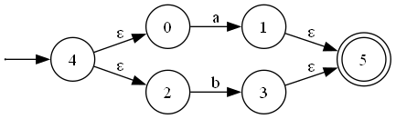
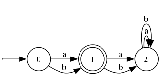
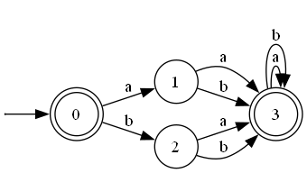

# Автомат из регулярного выражения

Консольное приложение на C++: регулярное выражение → НКА (Томпсон) → ДКА → полный ДКА → минимальный полный ДКА (МПДКА).

Поддерживаются также устранение ε-переходов, дополнение языка, проверка слова и отрисовка автомата через Graphviz.

## Синтаксис регулярных выражений

| Запись | Смысл |
|--------|--------|
| `a`, `b`, … | символ алфавита |
| `1` | пустое слово (ε) |
| `ab` | конкатенация |
| `a+b` | объединение |
| `a*` | звезда Клини |
| `( … )` | группировка |


## Сборка

Нужны CMake 3.16+, компилятор C++17 и [Graphviz](https://graphviz.org/) (`dot` в `PATH`) для команды `draw`.

```powershell
cmake -B build -S .
cmake --build build
```

Исполняемый файл (MSVC): `build\Debug\automata.exe`.

## Запуск

```powershell
.\build\Debug\automata.exe
```

Пример сессии:

```text
Enter a regular expression:
> (a+b)*abb

What do you want to do with the expression?
Options: to_nfa help exit
> to_nfa
NFA built.

What do you want to do with the automaton?
> minimize draw
Done: minimize
Image saved: output/automaton_1.png

> accept
Enter a word (empty line = epsilon): abb
yes

> new
```

Картинки из `draw` сохраняются в `output/` относительно текущей рабочей директории.

### Команды для выражения

| Команда | Действие |
|---------|----------|
| `to_nfa` | построить НКА |
| `help` | справка |
| `exit` | выход |

### Команды для автомата

Можно писать цепочку через пробел, слева направо: `minimize determinize draw`.

| Команда | Действие |
|---------|----------|
| `determinize` | детерминизация |
| `complete` | сделать автомат полным |
| `minimize` | минимизация (алгоритм Бржозовского) → МПДКА |
| `epsilon_closure` | убрать ε-переходы через ε-замыкание |
| `complement` | дополнение языка (сначала ДКА + complete) |
| `print` | вывести автомат в формате DOT |
| `draw` | сохранить PNG через Graphviz |
| `accept` | проверить слово |
| `help` | справка |
| `new` | новое регулярное выражение |
| `exit` | выход |

## Примеры

### 1. `a+b` - НКА Томпсона

После `to_nfa` + `draw` получается НКА с ε-переходами:



### 2. `a+b` - минимальный полный ДКА

После `minimize draw`:



Язык `{a, b}`: старт не допускающий, одно допускающее состояние после одной буквы, сток для более длинных слов.

### 3. Дополнение к `a+b`

После `complement draw` (или `to_nfa` → `complement`):



Принимаются ε и все слова длины ≥ 2 над `{a, b}`; отвергаются только `a` и `b`.

## Тесты

```powershell
cmake --build build --target automata_tests
.\build\Debug\automata_tests.exe
```

Покрытие (нужен MinGW `g++` и `gcov`):

```powershell
.\scripts\run_coverage.ps1
```

Скрипт собирает тесты с `--coverage` и проверяет, что суммарное покрытие `NFA.hpp`, `Regex.hpp` и `DotExport.hpp` не ниже 95%.

## Структура проекта

```text
NFA.hpp           - автомат: ε-замыкание, determinize, complete, minimize, …
Regex.hpp         - разбор регулярки и конструкция Томпсона
DotExport.hpp     - запись DOT и вызов Graphviz
main.cpp          - интерактивная консоль
tests/            - GoogleTest
docs/images/      - примеры картинок для README
scripts/run_coverage.ps1
CMakeLists.txt
```

## Зависимости

- C++17
- CMake
- GoogleTest (подтягивается через `FetchContent`)
- Graphviz (`dot`) - только для `draw`
